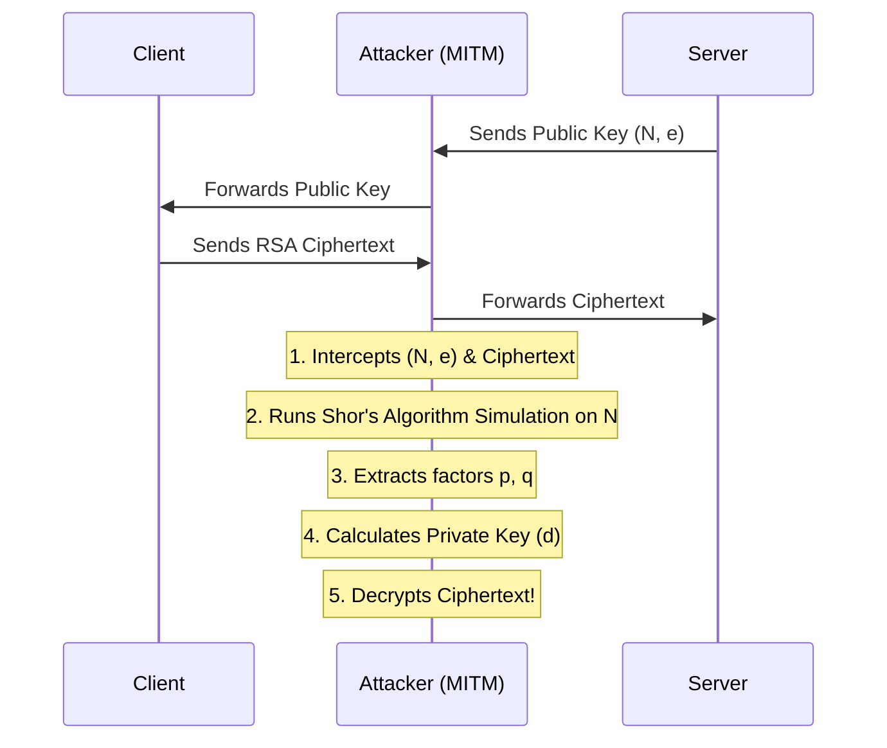

Quantum Network Attack Simulator


Introduction

This project is a **research-style cybersecurity simulation** that demonstrates a foundational threat in modern cryptography: **How quantum computers could break RSA encryption.**

Today's secure network communication (like HTTPS/RSA) relies on the mathematical difficulty of factoring large prime numbers. For a classical computer, factoring a massive RSA modulus ($N = p \times q$) takes an impractically long time. However, **Shor's Algorithm**, when run on a large-scale quantum computer, can solve this in polynomial time.

Since we don't have a large-scale quantum computer, this project simulates the attack logic entirely on a classical machine, combining:
* **Socket Networking**
* **RSA Cryptography**
* **Man-in-the-Middle (MITM) Packet Sniffing**
* **Quantum Algorithm Simulation (Shor's)**

 Project Goal

The primary goal of this simulation is to demonstrate how a quantum adversary could break encrypted network communications.

It simulates a scenario where an attacker intercepts a transmission, uses Shor's period-finding math to factor the RSA modulus, reconstructs the private key, and decrypts the intercepted ciphertext—all presented in a rich, dark-web style CLI interface.
 Architecture & Attack Simulation Flow

The system consists of 4 main components working together:

1. **Client (`client.py`)**: Encrypts a secret message using the server's public key and sends it over the network.
2. **Server (`server.py`)**: Generates an RSA keypair, distributes the public key, and waits to receive and decrypt messages.
3. **MITM Attacker (`attacker_mitm.py`)**: A proxy sniffer that intercepts the network traffic, capturing the public key ($N, e$) and the encrypted payload.
4. **Quantum Module (`shor_simulation.py` & `decrypt_attack.py`)**: Runs a classical simulation of Shor's quantum period-finding routine to determine the prime factors ($p, q$) of $N$, calculates the private key ($d$), and decrypts the intercepted message.
Attack Sequence


How to Run the Simulation

### Prerequisites
- Python 3.8+
- Install the required dependencies:
  ```bash
  pip install -r requirements.txt
  ```
 Execution Steps
To view the full real-time attack simulation, open **3 separate terminal windows**.

**Terminal 1 (The Secure Server):**
```bash
python server.py
```
*The server will generate an RSA keypair and listen for connections.*

**Terminal 2 (The Hacker / MITM Attacker):**
```bash
python decrypt_attack.py
```
*This launches the dark-web style dashboard. It starts the proxy sniffer waiting for traffic. Keep this terminal visible.*

**Terminal 3 (The Victim Client):**
```bash
python client.py
```
*The client connects to the proxy, encrypts a secret message ("TOP SECRET: QUANTUM ALGORITHM FOUND"), and sends it.*

**Observe Terminal 2:** You will see the attacker intercept the packet, simulate the quantum factoring of the modulus $N$, reconstruct the private key, and print the decrypted message in real-time!

## 📂 Repository Structure
```text
quantum-network-attack-simulator/
│
├── rsa_utils.py          # Textbook RSA mathematical implementation
├── server.py             # Secure server node
├── client.py             # Sender client node
├── attacker_mitm.py      # Network proxy to intercept public key and ciphertext
├── shor_simulation.py    # Classical simulation of Shor's quantum period-finding
├── decrypt_attack.py     # Orchestrator: runs proxy, factors N, decrypts
├── requirements.txt      # Python dependencies (rich, etc.)
└── README.md             # This file
```

## ⚠️ Disclaimer
*This project is built for educational and research purposes only to demonstrate cryptographic vulnerabilities in the context of quantum computing. The RSA implementation uses intentionally small bit sizes to allow the simulation of Shor's period finding to run in a reasonable time on classical hardware.*
